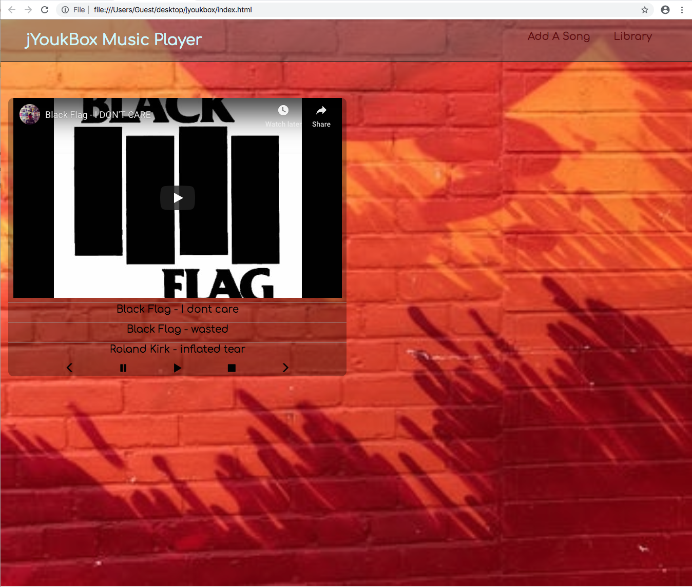
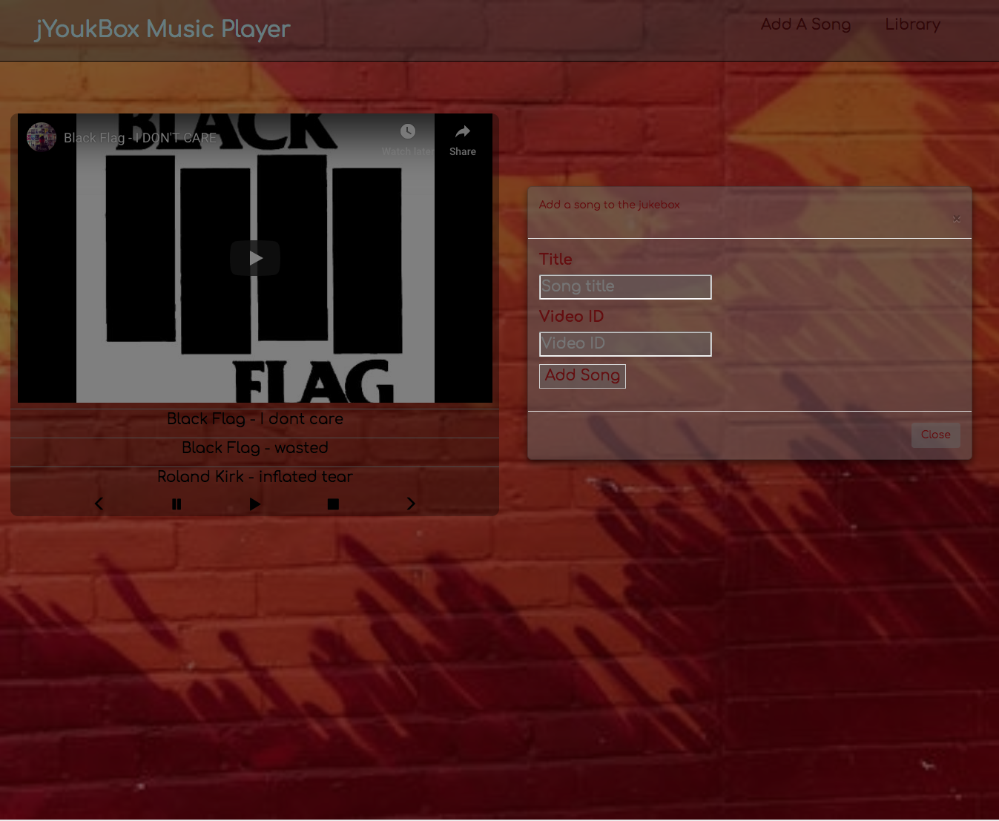
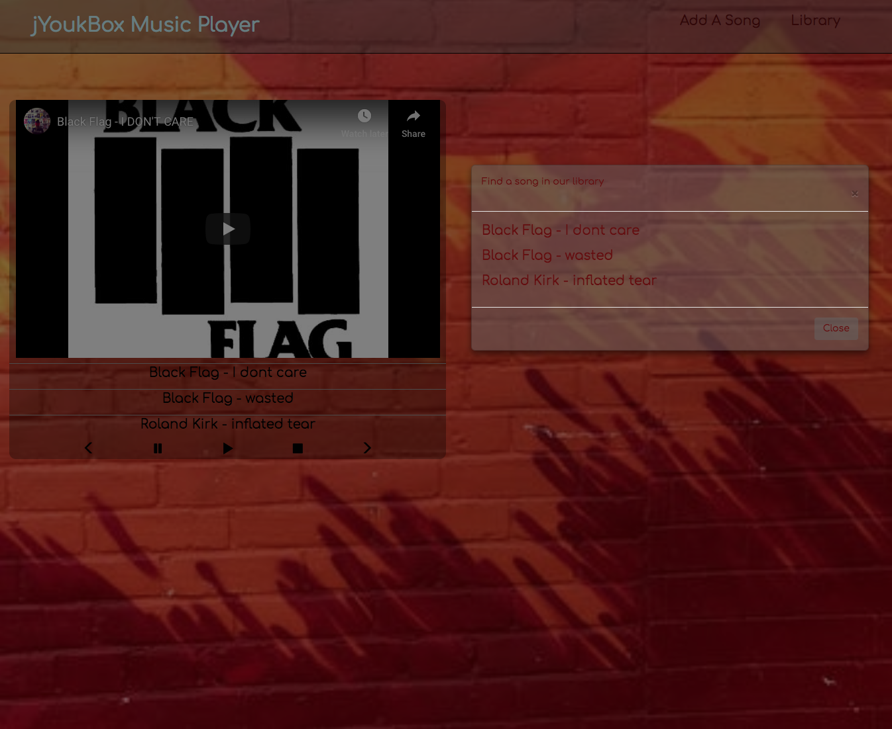

# jYoukBox

#### A song/video player

#### Scott Bergler, Chris Cahill & Ryan Leslie

## Description
The goal of this project is to create a Spotify-like song/video player. A user can create/generate a list of media to play. It will play through that list and the user can continue to add to the list as it plays. Ultimately, we would like multiple users to be able to add to the list from their own devices (tablets, phones, etc.).

### Current functionalities:
##### Library and Song Queue:
The library is a storehouse of songs the user can choose to add to the song queue.

The song queue is a list of songs that are queued up to be played in sequence.

The application preloads a few songs into the library and song queue (see image above). The user can hit the play icon to start the videos. It will play through those videos and stop.

The user can add songs to the song queue in two ways:

The first way involves the user going to YouTube to get the video's url and entering that along with any title they would like in the form shown above. These songs are put into the library and into the song queue;

A song can be deleted from the queue by clicking on the REMOVE that shows when the mouse is hovered over the display.

Songs cannot currently be deleted from the library via the UI. The methods are working in the console, but getting them targeted to elements in the DOM has proven difficult.

The second way a user can add to the song queue is by looking at the songs loaded into the library. Clicking on any song in that list will add it to the song queue.

##### Automatic skip and delete videos that are unavailable:
If a video won't play (due to restrictions - like The Beatles - or no longer available) the player will delete that video from the queue and move on to the next video.

##### Highlighting the title of the currently playing song.
The song remains as it was in the queue, but is added to a marquee above the display as well.

### Planned functionalities:
##### History:
We would like to have a history of previously played media. We removed the "back" button since we didn't have time to get this running before presentation.

##### Remove from library:
The user interface does not currently allow songs to be deleted from the library. The methods to do so are in place, but we weren't able to get them targeted to the right elements in the DOM.

### Specifications:
##### Spec 1: Create a song object:
- [x] **Expect:** ;

##### Spec 2: Create a new song:
- [x] **Expect:** ;

##### Spec 3: Add song to play queue:
- [x] **Expect:** input: a song/output: song added to queue;

##### Spec 4: console.log queue:
- [x] **Expect:** input: console.log(queue)/output: list of songs added to queue;

##### Spec 5: find song in libray:
- [x] **Expect:** input: video Id / return: video index;

##### Spec 6: remove song from libray:
- [ ] **Expect:** click to remove a song from the library;

##### Spec 6: display libray:
- [x] **Expect:** user clicks on library-linked element, the library shows as a list;

##### Spec 7: A click on song in library list adds that song to the queue:
- [x] **Expect:** user clicks on library-linked element, the library shows as a list;

##### Spec 8: Remove a song from the queue:
- [x] **Expect:** user clicks on song to remove it from the list;

##### Spec 9: Highlight Now Playing song:
- [x] **Expect:** Title is displayed more prominently;

##### Spec 10: Pre-load library:
- [x] **Expect:** 9 songs are already in the library when the app loads;

## Setup/Installation Requirements
To view or clone the code, go to [GitHub](https://github.com/skillitzimberg/JYoukBox).

The page is live at: [GitHub]( ).

## Known Bugs
The player stalls on occasion at the end of videos. There is likely a play state we are unaware of at this time.

If the last song in the queue is broken or unavailable the player will show an ugly error message and keep trying to load a new video. Adding a new song allows the app to continue.

## Support and contact details

Where to complain/suggest

## Technologies Used

HTML, CSS, & Javascript. More?

### License

Licensed under the MIT license.

Copyright (c) 2018 ** Authors **
